### Memes aside, configuring Arch linux on my proxmox server was a fun way to spend a saturday afternoon. This was my first time using Arch. It was quite the experience. 

**Step 1.** Downloading the ISO.
    Installing the ISO is pretty straightforward. Select your choice of torrenting software and get the ISO from: [here](https://archlinux.org/download/)

There are of course other avenues such as Docker images, Netboot, Vagrant images and HTTP.

**Step 2.** Once you have your ISO downloaded and saved somewhere, Connect to your Proxmox instance and "Create VM". The only options I changed from the default were the BIOS settings under the "system" tab. I changed my settings from the Default(SeaBIOS) to OVMF (UEFI) and selected my EFI Storage. 
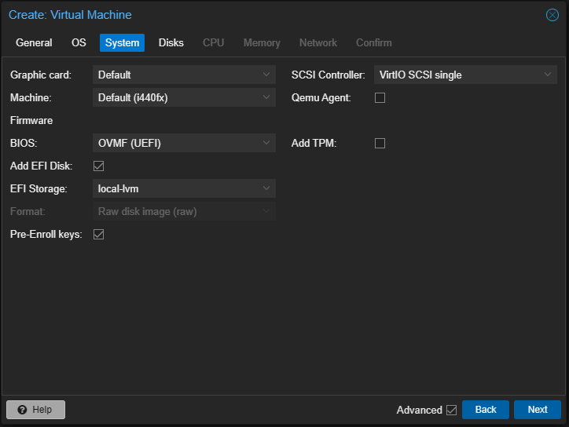

**Step 3.** Once you start your VM, You will want to press "esc" quickly to load into the Device Manager. And make sure "Attempt Secure Boot" is unchecked and shutdown the VM.
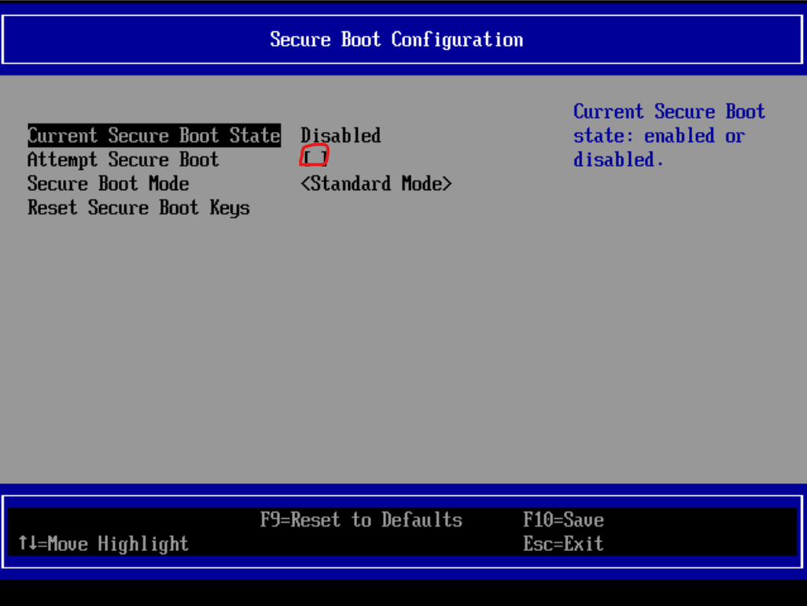

**Step 4.** ITS ALIVE! Well not quite but we are getting there. If you were lucky you'll be presented with this screen in your console.
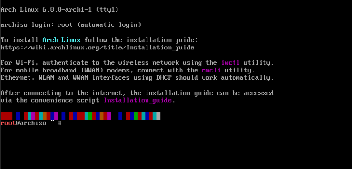

**step 5.** This will be the first test to see if we've done things right. Run this script:
```sh
sh cat /sys/firmware/efi/fw_platform_size
```
After its been run you should see either 64 or 34 if you have booted into UEFI correctly. If not you will need to disable secure boot and possibly reinstall?

**step 6.** Now check to make sure you're connected to the internet. If you're connected to the internet and can Ping an external I.P. You're ready to move on to the next step.
```sh
ip link
```
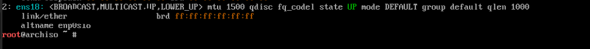

**step 7.** Update your System Clock by running the following command.
```sh
timedatectl
```
**Step 8.** Now its partition and format fun time! To check if your drives are actually appearing you can run:
```sh
fdisk -l
 ```
This will display a list of all drives.
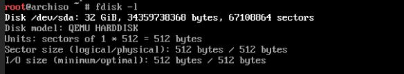
* Since this is a UEFI install, we will want three partitions in total. 
* Boot partition will be the EFI system partition and be 1GiB.
* The Swap partition which is reccomended at 4GiB.
* Finally the Root partition which will be the remainder of the drive or a size you deem reasonable with atleast 23-32GiB.
#### open the target disk with 'fdisk' to create the partitions
 ```sh
 fdisk /dev/sda
 ```
#### Create a new GPT Partition table
 ```sh
 Command (m for help): g
 ```
 
#### Create the EFI System Partition

1. Type n to create a new partition.
1. Select the default partition number (1).
1. Accept the default first sector.
1. Specify the last sector as +1G to create a 1GB partition.
1. Change the partition type to EFI System Partition by typing t, then selecting 1 for the partition number and 1 for the EFI System Partition type.
```sh
Command (m for help): n
Partition number (1-128, default 1): (Press Enter)
First sector (2048-...): (Press Enter)
Last sector, +sectors or +size{K,M,G,T,P} (2048-...): +1G
Command (m for help): t
Selected partition 1
Partition type (type L to list all types): 1
```
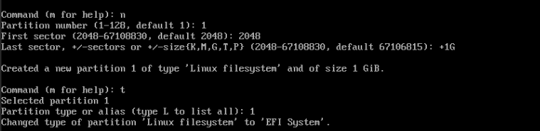

#### On to the swap partition:
1. Type n to create a new partition.
1. Select the default partition number (2).
1. Accept the default first sector.
1. Specify the last sector as +4G to create a 4GB partition.
1. Change the partition type to Linux swap by typing t, then selecting 2 for the partition number and 19 for the Linux swap type.
```sh
Command (m for help): n
Partition number (2-128, default 2): (Press Enter)
First sector (2048-...): (Press Enter)
Last sector, +sectors or +size{K,M,G,T,P} (2048-...): +4G
Command (m for help): t
Partition number (1, 2, default 2): 2
Partition type (type L to list all types): 19
```
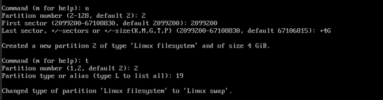

#### Now onto the final partition! The ROOT!
1. Type n to create a new partition.
1. Select the default partition number (3).
1. Accept the default first sector.
1. Accept the default last sector to use the remaining space.
```sh
Command (m for help): n
Partition number (3-128, default 3): (Press Enter)
First sector (2048-...): (Press Enter)
Last sector, +sectors or +size{K,M,G,T,P} (2048-...): (Press Enter)
```
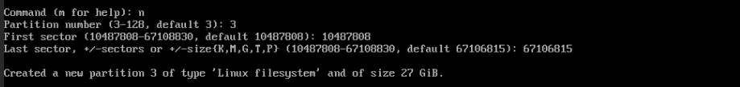
#### Now time to actually write these changes:
```sh
Command (m for help): w
```
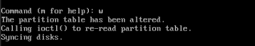

#### Format the Partitions

Format the EFI System Partition as FAT32:
```sh
mkfs.fat -F32 /dev/sda1
```
Format the root partition as ext4:
```sh
mkfs.ext4 /dev/sda3
```
Now initialize the swap partition:
```sh
mkswap /dev/sda2
swapon /dev/sda2
```
Your output should look like this when done
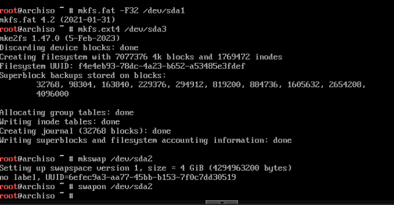

#### Last but not least, now we mount the partitions:
Mount the root partition:
```sh
mount /dev/sda3 /mnt
```
Create and mount the EFI directory:
```sh
mkdir -p /mnt/boot/efi
mount /dev/sda1 /mnt/boot/efi
```

You can verify your partitions are setup correctly by using:
```sh
fdisk -l
```
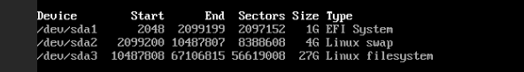
And your output should look like the above screenshot.

#### Package time!

**step 9.** First we will install the base package. This may take a minute or two.

```sh
pacstrap -K /mnt base linux linux-firmware
```
Now that thats installed, **REMEMBER** Arch is **VERY** barebones, basically as barebones as it comes. So in order to connect to the internet and use text editors we will have to install the packages to do so. Feel free to install any package you would like at this point. But for our purposes I will be installing dhcpcd and Nano.

Chroot into your system.
```sh
arch-chroot /mnt
```
then install the DHCP client
```sh
pacman -S dhcpcd
```
Enable and start the DHCPP Client Service. You will want to leave chroot to start the service.
```sh
exit
systemctl enable dhcpcd
systemctl start dhcpcd
systemctl status dhcpcd
```
then go back into chroot to install Nano (or your text editor of choice)
```sh
arch-chroot /mnt
pacman -S nano
```
To verify nano is installed run:
```sh
nano --version
```
we will also be installing these for later.
```sh
pacman -S inetutils systemd
```
#### Create the fstab file
Make sure you are not in Chroot by typing "exit" in the terminal.
and use this command to create the fstab file:
```sh
genfstab -U /mnt >> /mnt/etc/fstab
```
#### Chroot with Time zone and localization
Now we go back into chroot
```sh
arch-chroot /mnt
```
Set the time zone:
```sh
ln -sf /usr/share/zoneinfo/Region/City /etc/localtime
hwclock --systohc
```
#### Create the hostname file
Type anything you want for "yourhostname".
```sh
nano /etc/hostname
yourhostname
```

#### Set root password
Change your root password with this command:
```sh
passwd
```
#### Bootloader time
For this I've gone with GRUB, however there are a plethora of different boot loaders out there to choose from.
\
**Make sure you are in Chroot**
```sh
arch-chroot /mnt
```
Download Grub and required packages:
```sh
pacman -S grub efibootmgr
```
Install GRUB bootloader for UEFI: (This step will be different if not using UEFI)
```sh
grub-install --target=x86_64-efi --efi-directory=/boot/efi --bootloader-id=GRUB
```
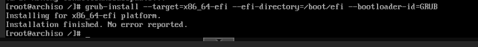
Then generate the GRUB config file:
```sh
grub-mkconfig -o /boot/grub/grub.cfg
```
# We're almost done!
Now we will exit Chroot, unmount our drives and reboot. 
```sh
exit
umount -R /mnt
reboot
```
Now with any luck you should be greeted with this screen where you will login as "Root" and whatever password you set earlier.

 Now once logged in the wild world of Arch Linux is as your disposal. From here you can install a GUI, or anything else you might think of. The Arch Linux Wiki has some amazing reccomendations on first steps. I will leave the link below. 
[https://wiki.archlinux.org/title/General_recommendations]


 

